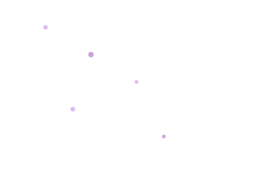
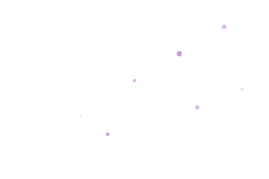
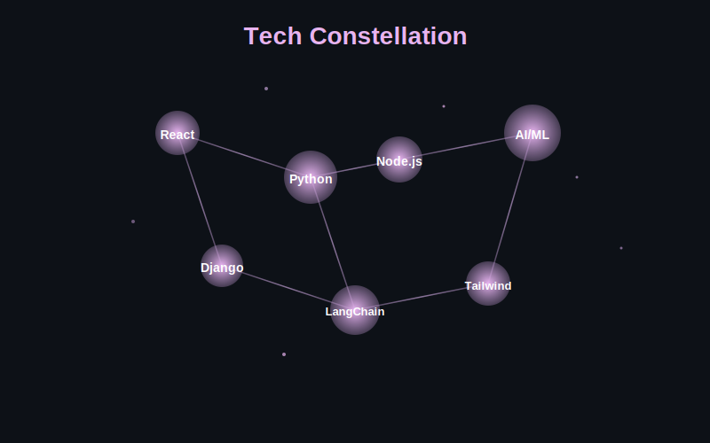

# Kanchi Kumari's GitHub Profile

<!-- 
  SAVE THIS AS: banner.svg
  Upload to your GitHub profile repo (e.g., username/username/banner.svg)
  Then reference it in the README
-->

<div align="center">



<!-- 
  ANIMATED TYPING HEADLINE
  SAVE THIS AS: headline.svg
-->


</div>

---

<!-- 
  FLOATING STARS DECORATION
  SAVE THIS AS: stars-left.svg and stars-right.svg
-->




<br clear="both"/>

## 🌸 About Me

```python
class KanchiKumari:
    def __init__(self):
        self.role = "Full-Stack Developer & AI/ML Engineer"
        self.location = "Building in the cloud ☁️"
        self.passion = [
            "Architecting scalable full-stack applications",
            "Training ML models that actually solve problems",
            "Building AI-powered experiences",
            "Turning complex data into intelligent systems"
        ]
        self.current_focus = "LLM applications & vector databases"
        
    def get_expertise(self):
        return {
            "frontend": ["React", "Next.js", "Tailwind CSS"],
            "backend": ["Node.js", "Django", "FastAPI", "Firebase"],
            "ai_ml": ["Python", "TensorFlow", "PyTorch", "LangChain", "Pinecone"],
            "databases": ["PostgreSQL", "MongoDB", "ChromaDB", "Redis"],
            "cloud": ["AWS", "GCP", "Docker", "Kubernetes"]
        }
    
    def build(self):
        return "Intelligent applications with beautiful interfaces"
```

<div align="center">

<!-- 
  SKILL CONSTELLATION
  SAVE THIS AS: constellation.svg
-->



</div>

---

## 🌌 Tech Galaxy

<div align="center">

<!-- Frontend Universe -->


<!-- Backend Cosmos -->


<!-- AI/ML Nebula -->


<!-- Database & Cloud Stars -->


</div>

---

## 📊 Cosmic Stats

<div align="center">


</div>

<div align="center">


</div>

---

## ✨ Current Projects

<div align="center">

<!-- 
  PROJECT CARDS
  SAVE THESE AS: project-card-1.svg, project-card-2.svg, project-card-3.svg
-->

<table>
<tr>
<td width="33%">

### 🤖 AI Chat Assistant
**LangChain + Vector DB**

Building a context-aware chatbot using RAG architecture with ChromaDB for semantic search

`Python` `FastAPI` `Pinecone`

</td>
<td width="33%">

### 🌐 Full-Stack SaaS
**Next.js + Firebase**

Multi-tenant platform with real-time collaboration and AI-powered analytics

`React` `Node.js` `Tailwind`

</td>
<td width="33%">

### 🧠 ML Pipeline
**Model Training & Deployment**

End-to-end ML workflow with automated retraining and API serving

`PyTorch` `Docker` `AWS`

</td>
</tr>
</table>

</div>

---

## 🌙 Let's Connect

<div align="center">

[](https://linkedin.com/in/YOUR_PROFILE)
[](mailto:your.email@example.com)
[](https://your-portfolio.com)
[](https://twitter.com/YOUR_HANDLE)

</div>

---

<div align="center">

<!-- 
  FLOATING AI ASSISTANT
  SAVE THIS AS: ai-assistant.svg
-->


**💫 Always building, always learning, always dreaming in code 💫**


</div>

---

<!-- 
  FOOTER WAVE
  SAVE THIS AS: footer-wave.svg
-->


